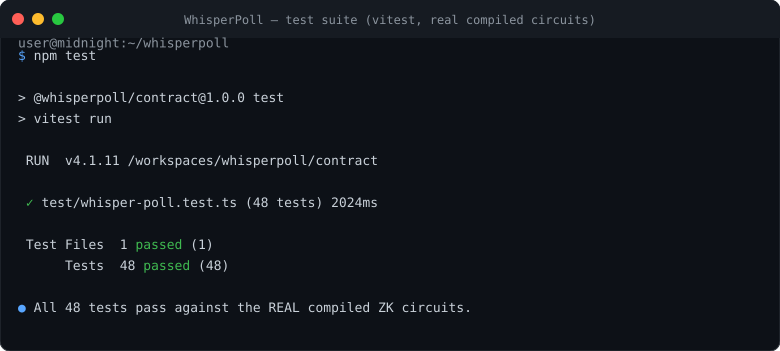

# WhisperPoll

> **Anonymous, verifiable polls on the Midnight Network.**
> One person, one vote — enforced with zero-knowledge proofs, without revealing *who* voted or *how* they are identified. Voters are represented by ZK pseudonyms derived from a secret key that never leaves their machine; ballots and tallies are public and independently verifiable on-chain.

## Product description

WhisperPoll is a privacy-preserving polling contract for communities that need trustworthy decisions without surveillance: DAOs, activist groups, clubs, and workplaces. A poll admin opens a poll (2–4 options); anyone can cast or change a ballot while the poll is open; the admin closes it and the tallies are final. Every ballot is bound to a **ZK pseudonym** (a hash of the voter's secret key), so:

- **One person, one vote** — double voting is rejected on-chain,
- **Voter privacy** — the secret key never leaves the voter; only its hash appears on-chain,
- **Public verifiability** — tallies, total votes, and the full ballot pseudonym set are public ledger state,
- **Admin control** — only the ZK-committed admin can close a poll.

Built as a [Compact](https://docs.midnight.network/compact) smart contract for the [Midnight Network](https://midnight.network), tested against the real compiled ZK circuits, with a one-command path to a public Midnight testnet deployment.

## Status

| Item | Value |
|------|-------|
| Compilation | ✅ `compact compile 0.31.1` — 4 circuits compiled ([proof](docs/evidence/compile-proof.txt)) |
| Tests | ✅ 48/48 against the real compiled circuits ([proof](docs/evidence/test-proof.txt)) |
| On-chain deploy | ⏳ pending — no deployment receipt yet: both deployer wallets are funded (Preprod also registered for DUST); the deploy transaction has not been submitted |
| Compiler | `compact compile 0.31.1` (language version 0.23) |
| Toolchain | Node ≥ 24.11, npm ≥ 10 |

### Deployer wallets (public funding addresses)

Each network gets its own deployment wallet, persisted as `deploy/.seeds/<network>.seed` (git-ignored, `chmod 600`) and reused on every run so the funds stay with the same wallet. A wallet's **unshielded address** is public by design — it is how the wallet receives testnet tokens. Its secret seed is never committed and never logged.

| | Midnight **Preview** | Midnight **Preprod** |
|---|---|---|
| Address | `mn_addr_preview1y3d7d6hw48lmz3qwsae70xff8xmf8866vkzqn6djmhc276kwe95sadpq9q` | `mn_addr_preprod129lknssx5lclnq8h47q534qqc0klylgsah2zdmsvxx9240u39jcq3kw75n` |
| Fund via | <https://faucet.preview.midnight.network> | <https://faucet.preprod.midnight.network> |
| Coin public key | `f1c3119717aa645930fc6783747d39bbe8583d46c20f1eea13e061e41d3d4c17` | `6c2c52a74e9b7d6aea7e3a09464ffd89c569c4902aa57dfc1c1a45e111a5ba81` |
| Funding status | ✅ funded — 5,000,000,000 raw NIGHT, unspent (tx `b8dbaf35415aea90a199a6044601ebaeee09da6477f741117ef43ac780084929`, block 994300, 2026-09-23 17:20:30 UTC) | ✅ funded and registered for DUST generation — 5,000,000,000 raw NIGHT (drip tx `b9a0ddcca233547dc0c33644c6cd74438e20b2b239f39fc3af11886fcc0d6a14`, block 2707307, 2026-09-25 18:38:36 UTC; DUST registration tx `d1914256450812d825d8130ba2edb81a16ef47091bf1eea84b3574b45d146482`, block 2707426, 2026-09-25 18:50:30 UTC) |

Funding is confirmed on-chain, not by trust: a drip appears as an unshielded NIGHT UTXO owned by the address in the network's indexer, and the deploy script waits for that balance before it proves anything.
Once funds arrive, `npm run deploy:preview` or `npm run deploy:preprod` picks up automatically and writes the receipt with the live contract address to [`deploy/deployments/`](deploy/deployments/).

### Current Preview deployer (awaiting funds)

The seed generated in this checkout derives a **new** Preview wallet, so it holds no NIGHT yet. Fund it at <https://faucet.preview.midnight.network>, then `npm run deploy:preview` completes automatically (the seed is reused on every run, so the funds stay with this wallet):

```
mn_addr_preview1mmvsuev5xzyxapu7q8d3nnh9vqt2srqtl42gl433chphju06hukqtfj0vw
```

On a memory-constrained machine, prefix the deploy with `NODE_OPTIONS=--max-old-space-size=8192` (see [Troubleshooting](#troubleshooting)).

---

## Repository layout

```
.
├── contract/                  # Compact smart contract (the product)
│   ├── src/
│   │   ├── whisper-poll.compact   # The contract: polls, ballots, tallies
│   │   ├── index.ts               # Compiled-contract binding for midnight-js
│   │   ├── witnesses.ts           # Private-state witnesses (secret key)
│   │   └── managed/               # GENERATED by `compact compile` (committed for reproducibility)
│   │       └── whisper-poll/      # circuits, prover/verifier keys, ZKIR
│   └── test/                      # Vitest suite running the REAL compiled circuits
├── deploy/                    # Headless deployment & interaction tooling
│   ├── scripts/               # deploy.ts, interact.ts (open/vote/close/tally)
│   ├── compose.proof-server.yml   # Local proof server for real deployments
│   └── deployments/           # Signed deployment receipts (committed; holds only
│                              #   .gitkeep until the first successful deploy)
├── .env.example               # All configuration, no secrets
└── package.json               # npm workspaces + one-command workflow
```

## Prerequisites

- **Node.js ≥ 24.11** (`node --version`)
- **npm ≥ 10** (`npm --version`)
- **Docker** with `docker compose` — used to run a local **proof server** (required for real deployments; not needed for tests)
- ~4 GB free disk (ZK proving parameters are large)

### Compact toolchain

The Compact devtools manage the compiler:

```bash
# Install the devtools
curl --proto '=https' --tlsv1.2 -LsSf https://github.com/midnightntwrk/compact/releases/latest/download/compact-installer.sh | sh

# Install the toolchain version this project pins
compact update 0.31.1

# Verify
compact compile --version   # → 0.31.1
```

## Installation

```bash
git clone <this repository>
cd whisperpoll
npm install          # installs all workspaces
```

## Compile the contract

```bash
npm run compile      # compact compile contract/src/whisper-poll.compact contract/src/managed/whisper-poll
```

The first run downloads ZK parameters (~hundreds of MB, one-time). This regenerates `contract/managed/` — circuits, prover/verifier keys, and the ZK intermediate representation. **The `managed/` directory is generated by the official tooling only** — never hand-edited.

## Build & test

```bash
npm run build        # TypeScript build for all workspaces
npm run test         # runs the full Vitest suite against the REAL compiled circuits
```

The test suite (**48 cases**) covers:

- **Core functionality** — open/vote/change/close lifecycle, tallies, totals
- **Valid inputs** — every option boundary, repeat voting by different pseudonyms
- **Invalid inputs** — invalid option indices, wrong sizes, out-of-range values
- **Permissions** — non-admin `closePoll` rejected; admin identity proven via ZK commitment
- **Edge cases** — re-opening a used contract, changing to the same option, tally invariants under churn
- **Failures & security** — double-vote prevention, voting on closed/unopened polls, ballot pseudonym binding, state-machine transitions

Tests execute the **actual compiled contract** (`contract/src/managed/whisper-poll`) through `@midnight-ntwrk/compact-runtime`, not a re-implementation — asserting the same ZK circuit logic that runs on-chain. A captured run transcript is in [`docs/evidence/test-proof.txt`](docs/evidence/test-proof.txt).

## Deploy

Deployments run **headless** (no interactive prompts) against a real Midnight network:

```bash
cp .env.example .env            # then edit: set DEPLOY_SEED (or let it generate one)
docker compose -f deploy/compose.proof-server.yml up -d   # local proving service

# Preview (public testnet — recommended)
npm run deploy:preview

# or Preprod
npm run deploy:preprod
```

The script will:

1. Build a wallet from `DEPLOY_SEED` (never logged in full, never committed),
2. Print your unshielded address and, if the wallet is unfunded, wait while you request test tokens from the human faucet (see [Faucet funding](#faucet-funding-human-in-the-loop)) (Preview/Preprod only),
3. Register NIGHT for **DUST** generation (the fee resource),
4. Prove + submit the deploy transaction via the proof server,
5. Write a **deployment receipt** to `deploy/deployments/<network>-<timestamp>.json` with the contract address, transaction hash, and endpoints.

### Faucet funding (human-in-the-loop)

The Midnight testnet faucets intentionally require a browser (Cloudflare Turnstile captcha) — see [`docs/evidence/deploy-proof.txt`](docs/evidence/deploy-proof.txt) for the API evidence. The deploy script therefore prints the address to fund and waits:

```
Unshielded address (fund this): mn_addr_preview1…
👉 Open the faucet, paste the address above, and request tokens:
   https://faucet.preview.midnight.network
Waiting up to 20 minute(s) for funds…
```

Once tokens arrive, deployment resumes automatically (DUST registration → proving → submission → receipt). The wallet seed persists in `deploy/.seeds/` (git-ignored), so you can re-run later without losing funds.

Then interact with the deployed poll:

```bash
npm run poll:open -- --network preview --contract <address> --title "Ship v2?" --options 3
npm run poll:vote -- --network preview --contract <address> --option 1
npm run poll:close -- --network preview --contract <address>
npm run poll:tally -- --network preview --contract <address>
```

## Deployment record

The authoritative record of live deployments lives in [`deploy/deployments/`](deploy/deployments/). After a successful deploy, each receipt is a JSON file with `network`, `contractAddress`, `deployTxHash`, `deployerAddress`, endpoints, and timestamp.

The whole sequence is one idempotent command — it deploys if no receipt exists yet, captures the live evidence, and refreshes the table below:

```bash
npm run post-deploy -- --network preview
```

<!-- deployments:start -->
_No live deployments yet — `deploy/deployments/` contains only its placeholder. Run `npm run deploy:preview` to record the first one._
<!-- deployments:end -->

Once a receipt exists, verify it on-chain (no trust in the deployer required):

```bash
npx tsx deploy/scripts/interact.ts --network <network> --contract <address> --action tally
```

## Verification evidence

Captured, reproducible transcripts of every claim in this README live in [`docs/evidence/`](docs/evidence/):

| File | What it proves |
|------|----------------|
| [`compile-proof.txt`](docs/evidence/compile-proof.txt) | `compact compile 0.31.1` compiling 4 circuits; full artifact list; byte-identical clean-room re-compile |
| [`test-proof.txt`](docs/evidence/test-proof.txt) | all 48 test cases passing, per-test verbose listing |
| [`deploy-proof.txt`](docs/evidence/deploy-proof.txt) | live proof-server startup, wallet creation, address funding flow, faucet-captcha API evidence, deployment continuation steps |

### Screenshots

**Compact compilation — 4 circuits compiled**


**Test suite — 48/48 against the real compiled circuits**



> The deployment screenshot (`docs/screenshots/deploy-proof.svg`) is generated by `npm run evidence:deploy` the moment a receipt exists — it shows the real contract address and a live on-chain tally.

Re-verify everything yourself with the acceptance audit (this re-compiles, re-tests, re-checks secrets hygiene, git history, docs and endpoints from scratch):

```bash
npm run audit          # bash scripts/audit.sh — exits non-zero on any failure
```

Regenerate the compile/test evidence from a live run at any time, or capture the deployment proof right after a successful deploy:

```bash
npm run evidence           # live compile + test transcripts + SVG screenshots
npm run evidence:deploy    # deploy transcript + SVG screenshot from the newest receipt
```

## Public state vs. private witness (how WhisperPoll uses Midnight)

Midnight contracts separate two kinds of data, and the compiler **enforces** the boundary:

| | Public ledger state | Private witness data |
|---|---|---|
| **Where it lives** | On-chain, visible to everyone via the indexer | On the user's machine (private state + ZK witness) |
| **In WhisperPoll** | `status`, `title`, `optionCount`, `ballots`, `tallies`, `totalVotes`, `adminHash` | the voter's/admin's 32-byte `secretKey` (via the `localSecretKey` witness) |
| **Who can read it** | Anyone | Only the owner |
| **Disclosed on-chain as** | — | only a `persistentHash` *pseudonym* or *commitment* |

- **Public state** is everything observers need to verify an election: the poll question, how many options exist, each pseudonymous ballot, the per-option tallies, and the total vote count. Anyone can recompute the tallies from `ballots` and check them against `tallies` — verification requires no trust in the admin.
- **The witness** (`localSecretKey`) is resolved on the voter's machine when a circuit runs. It is the *pre-image* of two domain-separated hashes:
  - `voterPseudonym(sk) = persistentHash("whisperpoll:pseudonym:", sk)` — the key under which the ballot is stored. On-chain, this is just an opaque 32-byte value; nobody can derive `sk` from it or link it to a wallet address.
  - `adminCommitment(sk) = persistentHash("whisperpoll:admin:", sk)` — stored at `openPoll` time; `closePoll` proves in-circuit that the caller knows the pre-image.
- **The compiler enforces non-disclosure.** Any flow of witness-derived data into a public ledger operation must be wrapped in an explicit `disclose()`. In WhisperPoll, `disclose()` appears exactly where we intend the (already one-way hashed) pseudonym/commitment to become public — and nowhere else. A feature that privately tested membership of a witness-derived key in a *public* map was rejected by the compiler's disclosure analysis and removed (see the note in `whisper-poll.compact`), which is the correct behavior.

So: **tallies are public and independently checkable; identity is private and never leaves the voter's machine.**

## Security model & trust assumptions

- The **secret key is witness data**: it enters the ZK circuit on the user's machine and is never disclosed on-chain. Only `persistentHash` pseudonyms/commitments appear in public state.
- `openPoll` can be called **once** per contract; the opener becomes the admin via a ZK commitment.
- `closePoll` requires proving (in-circuit) that the caller's secret key hashes to the stored admin commitment.
- Ballots are public by design (transparent tallies); pseudonym secrecy is what protects voter identity. Cross-poll correlation of a pseudonym is possible by design — deploy a fresh contract (or fresh secret key) per election for maximal unlinkability.
- The admin is trusted not to close prematurely; closing is irreversible. There is no admin ability to alter ballots — none exists in the circuit surface.

## Troubleshooting

| Symptom | Fix |
|---------|-----|
| `compact: command not found` | `source $HOME/.local/bin/env` or add `$HOME/.local/bin` to `PATH` |
| Compile errors about `pragma language_version` | Match the pragma in `whisper-poll.compact` to your installed toolchain (this repo pins 0.23 ↔ compiler 0.31.1) |
| Tests fail with `Cannot find module .../managed/...` | Run `npm run compile` first — tests run the compiled artifacts |
| First compile is slow / downloads ~500 MB | Normal: ZK parameter cache in `$HOME/.cache/midnight*` or `~/.compact` |
| `connect ECONNREFUSED 127.0.0.1:6300` during deploy | Start the proof server: `docker compose -f deploy/compose.proof-server.yml up -d` |
| Deployment stuck at "waiting for funds" | Faucet may be slow; check the receipt address on the network explorer, retry `deploy` (it reuses the same seed) |
| `DUST: 0` / deploy fails with fee errors | Wait for DUST generation to confirm (a few minutes), or re-run the deploy script |
| `JavaScript heap out of memory` during wallet sync | Prefix with `NODE_OPTIONS=--max-old-space-size=8192` (wallet sync is memory-heavy) |
| Faucet returns `Captcha verification failed` via curl | Expected — the faucet requires a browser captcha. Fund via <https://faucet.preview.midnight.network> in a browser, then re-run `npm run deploy:preview` |
| npm version conflicts on `@midnight-ntwrk/*` | Delete `node_modules` + lockfiles and `npm install` fresh; all Midnight packages are pinned to a compatible set (incl. the `ledger-v8` dedup override) |

## License

MIT — see [LICENSE](LICENSE).
